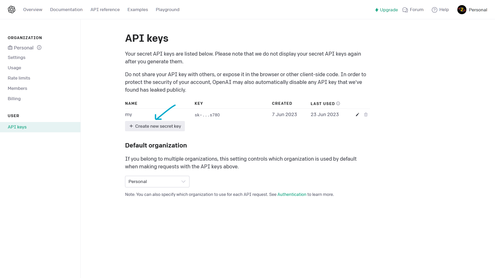
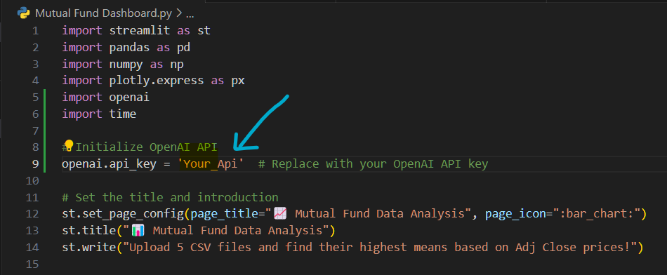

# Mutual_Fund_Data 📊💰


https://github.com/j-a-y-e-s-h/ai-data-analytics/assets/75063311/fd07aba2-a9f9-470e-8653-de696542146b


## Download File

Clone the repository to get started:

```bash
git clone https://github.com/j-a-y-e-s-h/ai-data-analytics
cd ai-data-analytics
```

## Installation 🛠️

Ensure you have the required dependencies installed. Copy and paste the following commands into your terminal:

```bash
pip install streamlit
pip install pandas
pip install numpy
pip install plotly
pip install openai
```

## Get OpenAI API Key 🤖

1. Log in to the [OpenAI API Website](https://platform.openai.com/account/api-keys).
2. Create a new API key by following the instructions.

   
   

4. Copy the API key and add it to the code where it says `'Your_Api'`.

   
   

## Run the App 🚀

Navigate to the folder and run the Streamlit app:

```bash
streamlit run 'Mutual Fund Data Analysis.py'
```

## Contributors 🤝

- [Jayesh](https://github.com/j-a-y-e-s-h)
- [Yash](https://github.com/YashPatil2023/)
- [Kamlesh](https://github.com/K-a-r-a-n-m-i-k-e-y)

## Enjoy The Magic 🔮🪄

Explore the world of mutual fund data analysis with a touch of AI! Simply follow the steps above, and you're ready to roll. Feel free to customize the code and add your own flair.

Happy analyzing! 📈💻🚀


<p align="center"> 
  <a href="https://python.org"></a> 
  <br> 
   
   <br> 
   
   
   
</p>
